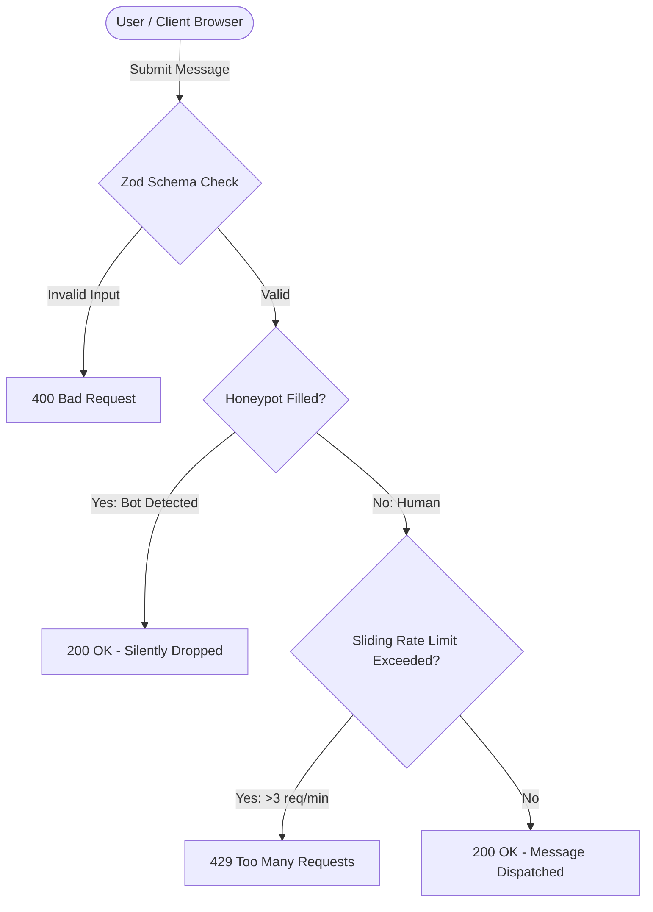

# 🛡️ Youssef Sameh EL-Gendy — Cybersecurity & AI Portfolio

<div align="center">


**A high-performance, cyberpunk-themed portfolio showcasing offensive security expertise, artificial intelligence projects, professional credentials, and technical leadership.**

[Live Preview](https://github.com/JooSameh) • [LinkedIn Profile](https://www.linkedin.com/in/youssef-el-gendy-1b6b95369/) • [Report Vulnerability](#-security-architecture)

</div>

---

## ⚡ Overview

This repository houses the personal portfolio and digital identity of **Youssef Sameh EL-Gendy**, an Egyptian Cybersecurity Specialist, Offensive Security Practitioner, AI Developer, and Public Speaker.

The website delivers an immersive **Cyberpunk / Sci-Fi** aesthetic infused with offensive security motifs, terminal aesthetics, laser-scanning effects, dynamic neon glows, and production-grade security architecture on both client and backend layers.

---

## 🚀 Key Features

### 1. 🎴 Cyberpunk Hero Experience
- **Interactive Holographic Avatar:** Dynamic neon backlights (`#00F5FF` Cyan & `#39FF14` Matrix Green) with real-time laser sweep scanning line animation.
- **3D Floating Security Artifacts:** Interactive orbital security glyphs representing Network Defense, Cryptography, Packet Inspection, and Binary Exploitation.
- **Terminal Typing Effects:** Dynamic cyber-terminal text highlighting competencies in Offensive Security, Threat Intelligence, and AI Solutions.
- **Zero-Flicker Read-Only Presentation:** Clean portfolio display without intrusive admin controls or public upload buttons.

### 2. 🧠 Offensive Security & AI Projects
- **Arabic AI Voice-Activated Assistant (Qwen 2.5):** Custom voice interface and chatbot combining Qwen 2.5 LLM, Whisper ASR, local TTS engines, and Ollama in a localized Python/Gradio framework.
- **Academic Web Portal Penetration Testing:** Methodical vulnerability assessments detecting SQLi, XSS, and authentication weaknesses with remediation reports.
- **Ministry Cybersecurity Initiative:** Specialized hands-on curriculum delivering network reconnaissance, defense-in-depth, and ethical hacking training to 45+ students.

### 3. 🛠️ Heavyweight Technical Skills
- **Offensive Security:** Nmap, Metasploit Framework, Burp Suite, Scapy (Packet Crafting & Analysis), OWASP Top 10, Network Reconnaissance.
- **AI & Software Engineering:** Python, Gradio, Qwen 2.5, Whisper, Ollama, React, TypeScript, Tailwind CSS, SQLite, Git.
- **Systems & Infrastructure:** Linux Hardening (Kali / Ubuntu), Windows Server, Network Routing, File System Migration (NTFS/FAT32).
- **Communication & Leadership:** Technical team leadership, curriculum design, media broadcasting, and conference organizing.

### 4. 📜 Interactive Certificate Gallery (11 Credentials)
- **Grid Showcase:** Categorized credentials spanning Banking Systems, Media Diplomas, Arts & Performance, and IT Foundations.
- **Custom Lightbox Modal:** High-resolution modal with backdrop blur (`backdrop-blur-xl`), animated award seals, full-screen viewing, and triple-tier dismissal (ESC key, outer backdrop click, or direct close button).

### 5. 🔒 Hardened Contact Security Pipeline
- **Honeypot Bot Defense (`botField`):** Invisible honeypot trap catching automated crawlers and dropping spam payloads silently.
- **Sliding-Window IP Rate Limiting:** Enforces a maximum threshold of **3 submissions per minute per IP** to eliminate flood and spam attacks.
- **Strict Payload Restriction (10 KB):** Guards against Denial-of-Service (DoS) and memory exhaustion attempts.
- **Zod Data Sanitization:** Strict email validation, string trimming, and script stripping against XSS injections.

---

## 🏗️ Technology Stack

| Layer | Technology | Purpose |
| :--- | :--- | :--- |
| **Frontend Core** | React 18 + TypeScript | Component-based state management and type safety |
| **Bundler & Tooling** | Vite 6 | Sub-millisecond HMR and optimized production build |
| **Styling & Theme** | Tailwind CSS 4 + PostCSS | Cyberpunk design tokens, custom glows, and responsive grids |
| **Animation Engine** | Motion (`motion/react`) | Smooth entry transitions, floating nodes, and modal springs |
| **Icons & Typography** | Lucide React + Google Fonts | Orbitron (display headings) & Fira Code (monospace data) |
| **Backend & Edge API** | Hono + Node HTTP Proxy | Serverless Edge API handling secure contact dispatch |
| **Schema Validation** | Zod | Runtime input verification and payload sanitization |
| **Toasts & Feedback** | Sonner | Minimalist, non-blocking toast notifications |

---

## 📁 Project Structure

```text
├── api/
│   └── contact.ts              # Edge API endpoint with rate limiting & Honeypot
├── public/
│   ├── profile.png             # Transparent high-definition portrait
│   └── favicon.ico             # Applet cyber favicon
├── src/
│   ├── app/
│   │   ├── components/
│   │   │   ├── ui/             # Core UI primitives (Button, Input, Textarea, Sonner)
│   │   │   ├── About.tsx       # Bio, background, and quick facts
│   │   │   ├── CertificateModal.tsx # Fullscreen lightbox viewer
│   │   │   ├── Certifications.tsx   # 11-certificate gallery grid
│   │   │   ├── Contact.tsx     # Secure message dispatch form
│   │   │   ├── Education.tsx   # Academic background & degrees
│   │   │   ├── Experience.tsx  # Professional experience timeline
│   │   │   ├── Footer.tsx      # Cyberpunk footer & copyright
│   │   │   ├── Header.tsx      # Sticky navigation & mobile drawer
│   │   │   ├── Hero.tsx        # Holographic profile & hero banner
│   │   │   ├── ImageWithFallback.tsx # Resilient image component
│   │   │   ├── Preloader.tsx   # Futuristic initialization sequence
│   │   │   ├── Projects.tsx    # AI & security case studies
│   │   │   └── Skills.tsx      # Technical competence matrix
│   │   ├── App.tsx             # Root application orchestrator
│   │   └── index.html          # HTML5 entry with metadata & SEO tags
│   ├── styles/
│   │   ├── default_theme.css   # CSS variables & color definitions
│   │   ├── globals.css         # Cyberpunk animations & scanlines
│   │   └── index.css           # Global stylesheet & Tailwind directives
│   └── main.tsx                # Application mounting script
├── package.json                # Project dependencies & scripts
├── vite.config.ts              # Vite server & API routing configuration
└── README.md                   # Project documentation
```

---

## 🛠️ Getting Started

### Prerequisites
- **Node.js** (v18.0.0 or higher recommended)
- **npm**, **pnpm**, or **bun**

### 1. Clone the repository
```bash
git clone https://github.com/JooSameh/cybersecurity-portfolio.git
cd cybersecurity-portfolio
```

### 2. Install dependencies
```bash
npm install
```

### 3. Launch development server
```bash
npm run dev
```
Open your browser and navigate to `http://localhost:3000`.

### 4. Build for production
```bash
npm run build
```
The optimized static output will be generated inside the `dist/` folder ready for deployment on Vercel, Netlify, Cloudflare Pages, or Google Cloud Run.

---

## 🛡️ Security Architecture

The application adopts a **Defense-in-Depth** model:



- **Client-Side:** Controlled form fields, XSS character filtering, and disabled double-submit buttons.
- **Transport Layer:** Strict CORS headers and JSON payload cap at 10 KB.
- **Server-Side:** Sliding window timestamp mapping per remote IP address.

---

## 👤 About the Author

**Youssef Sameh EL-Gendy**  
*Cybersecurity Specialist • Ethical Hacker • AI Solutions Developer*

- 🌐 **GitHub:** [@JooSameh](https://github.com/JooSameh)
- 💼 **LinkedIn:** [youssef-el-gendy](https://www.linkedin.com/in/youssef-el-gendy-1b6b95369/)
- 📍 **Location:** Cairo, Egypt

---

## 📄 License

This project is licensed under the [MIT License](LICENSE) — feel free to explore, learn from, and adapt the techniques used throughout this codebase.

<div align="center">
  <sub>Built with precision, security, and passion. Powered by modern web standards.</sub>
</div>
